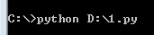

脚本上下文
==========

"Python scripts do not run in a vacuum."

Python 不是运行在真空中。

当前工作目录
------------

``CWD``——Current Working Directory

当前工作目录是一个十分重要的概念，是脚本处理的文件默认“呆”的地方，除非脚本中的文件名是绝对路径。
前一章提到，``os.getcwd()`` 获取 ``CWD`` 的名称，``os.chdir()`` 允许脚本将 ``CWD`` 转移到新的路径。

记住，不带完整路径的文件名会自动映射到 ``CWD`` 中，和 ``PYTHONPATH`` 没有关系。
从技术实现上看，脚本总是从 ``CWD`` 中启动的，而不是脚本所在的目录。
与此相反的是，``import`` 脚本总是包含脚本的目录开始，不是 ``CWD`` (除非脚本恰好也处在 ``CWD`` 下)。

在命令行窗口运行 Python 脚本：

``CWD`` 的值是 ``C:``。
打印系统搜索路径的前6项(``os.path[0:6]``)会发现 ``D:`` 也在其中。
这说明 Python 会自动将脚本的根目录添加到系统搜索路径中。
这样的话，无论在哪运行脚本，该脚本都可以直接加载相同目录下的其它文件。

假定 ``test.py`` 在 ``D:`` 目录下，则可以直接加载：

.. code-block:: Python

 import test

希尔环境变量
------------

* ``os.environ`` 存储所有环境变量
* 获取环境变量
  
  ``os.environ`` 是一个 Python 的字典，因而可以通过键名访问对应的键值。

  例如，设置系统环境变量 ``PYTHONPATH`` 之后，运行 Python 解析器，就会将 ``PYTHONPATH`` 自动加载到 ``os.environ`` 中。
  可以通过 ``os.environ["PYTHONPATH"]`` 语句来访问。
  
* 修改环境变量
  
  由于 ``os.environ`` 是一个字典，因而可以通过赋值的方式来修改环境变量。

  .. attention:: 父进程修改的环境变量可以被子进程继承。
   反之，子进程修改的环境变量对于父进程是不可见的。

  典型的例子：在命令窗口中执行脚本，命令窗口程序是父进程，通过 ``set`` 修改的环境变量可以被脚本程序继承。
  而脚本程序中的环境变量的修改不会在命令窗口中体现出来。

  Python 产生子进程的方法有：

  * os.popen
  * subprocess.popen
  * os.system
  * os.fork
  * os.spawnv
  * os.fork, etc.
  
标准流
------

.. code-block:: Python
 :linenos:

 sys.stdout.write('hello,world\n') # print('hello,world')
 sys.stdin.readline() # in = input()
                      # print in 

* 标准输入流的数据默认来自于键盘输入
* 标准输出流默认将输出文本打印到控制台窗口
* 标准错误流默认将错误信息打印到控制台窗口

流重定向
--------

为什么要引入流重定向呢？
最直接的应用是 Python 脚本进行白盒测试：提供输入，测试输出信息。
要截获输出到控制台的文本信息，必须用到流重定向。

在 Windows 命令窗口中这种重定向比较简单，使用 ``>/>>`` 命令可以很方便地将文本信息输出到某个文件中。例如：

.. code-block:: C
 :linenos:

 echo hello,world > 1.txt      ; 从 1.txt 开头进行覆盖
 echo hello,world >> 1.txt     ; 从 1.txt 结尾追加
 python input_name.py < 1.txt  ; 将 1.txt 的内容给脚本 input_name.py 的标准输入流

如果想将输出信息传递给另一个命令行，或者程序，可以使用管道指令 ``|``：

.. code-block:: Python
 :linenos:

 # 1.py

 import sys
 print sys.argv[1]

在命令窗口中执行指令：``echo hello,world | python 1.py``，打印结果为 ``hello,world``。

流重定向到 Python对象
---------------------

前面的流重定向都依赖于命令行，本节将介绍将流直接重定向到 Python 文件对象的方法。

Python 有一个很有意思的思想::
 
 “If it looks like a duck and quacks like a duck, it must be a duck.”

 长得像鸭子，叫得像鸭子，肯定是鸭子。

提供文件方法的对象都可以作为标准流：

* 带 ``read()`` 方法的对象可以赋值给 sys.stdin；
  ``read()`` 为输入流提供数据
* 带 ``write()`` 方法的对象可以赋值给 sys.stdout；
  所有标准输出都发给 ``write()`` 方法。

例如：

.. code-block:: Python
 :linenos:

 class Input(object):
     def read(self):
         return 'hello, world\n'
 class Output(object):
     def write(self, s):
         f = open('1.txt', 'w')
         f.write(s)
         f.close()
 
 sys.stdin = Input()
 sys.stdin.read() # 'hello, world'
 sys.stderr = Input()
 sys.stderr.read() # 'hello, world'
 sys.stdout = Output()
 sys.stdout.write('hello, world\n') #生成文件 1.txt，输入文本 'hello, world\n'

``print()`` 的重定向
--------------------

